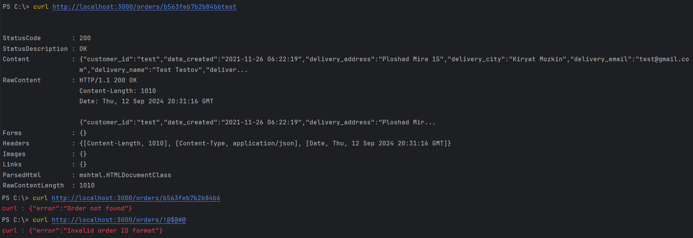
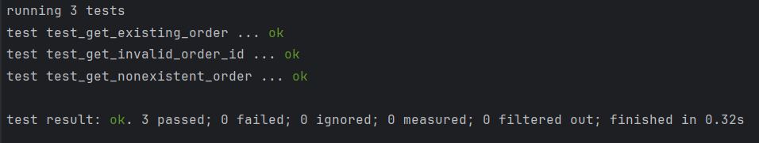

# Order service

Демонстрационный сервис, отображающий данные о заказе 

## Основные технологии и библиотеки

- **Rust**
- **PostgreSQL**

## Запуск
Установка необходимых зависимостей:
```cargo build```

Для запуска сервиса выполните команду:
```cargo run```

Сервер будет запущен по адресу http://localhost:3000.

## Использование
Для получения информации о заказе отправьте GET запрос на /orders/{id}, где {id} — идентификатор заказа.

Примеры:
- Существующий заказ: http://localhost:3000/orders/b563feb7b2b84b6test
- Не существующий заказ: http://localhost:3000/orders/nonexistentId
- Некорректный формат ID: http://localhost:3000/orders/!@#$%&

```
curl http://localhost:3000/orders/b563feb7b2b84b6test
```

Также можно отправить запросы, запустив скрипт из папки `scripts`



## Тестирование
Для запуска тестов используйте команду:
```cargo test```

